# Clínica Corazón

Aplicación web Full Stack para la gestión de turnos de una clínica médica.
Trabajo práctico final de la materia **Plataformas de Desarrollo – Análisis de Sistemas**.

# Integrante

- Axel Quesada

# Descripción

Clínica Corazón permite gestionar turnos médicos con tres tipos de usuario:

- **Administrador**: gestiona médicos y pacientes (alta, edición y baja) y visualiza todos los turnos del sistema con filtros por estado y por médico.
- **Paciente**: se registra, reserva turnos con el médico que elija y consulta o cancela sus turnos.
- **Médico**: consulta su agenda, filtra por fecha y estado, y marca turnos como atendidos.

La autenticación se realiza con JWT y las operaciones de escritura de la API están protegidas por un middleware que valida el token.

## Temática elegida

Clínica / gestión de turnos médicos. Entidades relacionadas: **Usuarios** (con rol admin, médico o paciente) y **Turnos** (relacionados con un paciente y un médico).

## Tecnologías utilizadas

**Backend**

- Node.js
- Express
- MongoDB + Mongoose
- JSON Web Token (jsonwebtoken)
- bcryptjs (hasheo de contraseñas)
- cors, dotenv

**Frontend**

- React 19
- React Router DOM 7
- Vite
- Tailwind CSS
- Fetch API (consumo de la API)
- Context API + Hooks (useState, useEffect, useContext)

# Estructura del proyecto

Clinica_corazon/
├── backend/ API REST (Node + Express + Mongoose)
│ ├── src/
│ │ ├── config/ conexión a MongoDB
│ │ ├── controllers/ lógica de auth, usuarios y turnos
│ │ ├── middleware/ verificación de JWT y roles
│ │ ├── models/ schemas de Mongoose (Usuario, Turno)
│ │ ├── routes/ endpoints REST
│ │ ├── seed/ carga de usuarios de prueba
│ │ └── server.js punto de entrada
│ ├── .env.example
│ └── package.json
└── frontend/ Aplicación React (Vite)
├── src/
│ ├── component/ componentes reutilizables
│ ├── context/ AuthContext y TurnosContext
│ ├── pages/ pantallas (login, dashboards, 404, etc.)
│ ├── services/ api.js (fetch + manejo del token)
│ └── App.jsx rutas con React Router
├── .env.example
└── package.json

# Instalación y ejecución local

Requisitos: Node.js 18+ y una base de datos MongoDB (local o MongoDB Atlas).

### 1. Backend

```bash
cd backend
npm install
cp .env.example .env
npm run seed              # carga usuarios de prueba
npm run dev               # levanta la API en http://localhost:4000
```

# 2. Frontend

```bash
cd frontend
npm install
cp .env.example .env      # VITE_API_URL apuntando al backend
npm run dev
```

# Variables de entorno

**backend/.env**

| Variable         | Descripción                                  |
| ---------------- | -------------------------------------------- |
| `PORT`           | Puerto de la API (por defecto 4000)          |
| `MONGO_URI`      | Cadena de conexión a MongoDB / MongoDB Atlas |
| `JWT_SECRET`     | Clave secreta para firmar los tokens         |
| `JWT_EXPIRES_IN` | Tiempo de expiración del token (ej. `8h`)    |

**frontend/.env**

| Variable       | Descripción                                     |
| -------------- | ----------------------------------------------- |
| `VITE_API_URL` | URL base de la API, `http://localhost:4000/api` |

# Usuarios de prueba

Se cargan ejecutando `npm run seed` en el backend:

| Rol      | Email               | Contraseña |
| -------- | ------------------- | ---------- |
| Admin    | admin@turnos.com    | 1234       |
| Paciente | paciente@turnos.com | 1234       |
| Médico   | medico@turnos.com   | 1234       |
| Médico   | medico2@turnos.com  | medico123  |

# API REST

Base: `/api`

# Autenticación

| Método | Endpoint         | Descripción                           |
| ------ | ---------------- | ------------------------------------- |
| POST   | `/auth/login`    | Inicia sesión y devuelve un token JWT |
| POST   | `/auth/register` | Registro público de pacientes         |

# Usuarios

| Método | Endpoint        | Protección               |
| ------ | --------------- | ------------------------ |
| GET    | `/usuarios`     | Token válido             |
| GET    | `/usuarios/:id` | Token válido             |
| POST   | `/usuarios`     | Token válido + rol admin |
| PUT    | `/usuarios/:id` | Token válido + rol admin |
| DELETE | `/usuarios/:id` | Token válido + rol admin |

# Turnos

| Método | Endpoint      | Protección   |
| ------ | ------------- | ------------ |
| GET    | `/turnos`     | Token válido |
| GET    | `/turnos/:id` | Token válido |
| POST   | `/turnos`     | Token válido |
| PUT    | `/turnos/:id` | Token válido |
| DELETE | `/turnos/:id` | Token válido |

# Funcionalidades incluidas

- API REST con Node.js y Express
- Persistencia con MongoDB y Mongoose (schemas, modelos y validaciones)
- CRUD completo sobre dos entidades relacionadas (Usuarios y Turnos)
- Autenticación con JWT y middleware de rutas protegidas
- Frontend en React con React Router (Login, Inicio, Listado, Alta, Edición y página 404)
- Componentes funcionales y hooks (useState, useEffect, useContext)
- Consumo de la API con Fetch
- Login/Logout con el JWT guardado en localStorage y rutas protegidas
- Roles de usuario (admin / médico / paciente)
- Búsqueda y filtrado de turnos
- Confirmaciones antes de eliminar registros

# Capturas de pantalla

Login
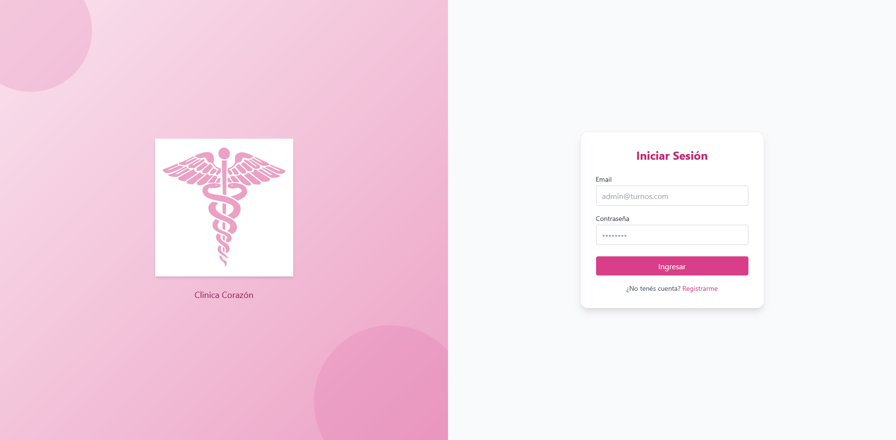

Register
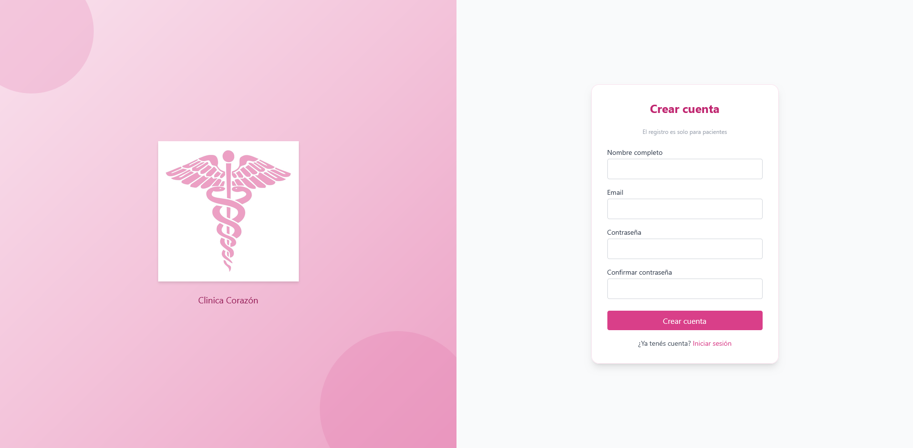

Inicio dashboard paciente
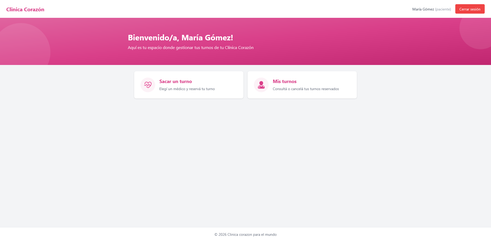

gestion de turnos en dashboard paciente
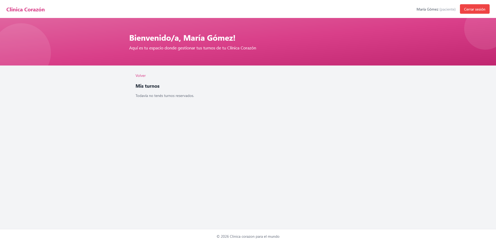

Formulario para crear turnos en dashboard paciente
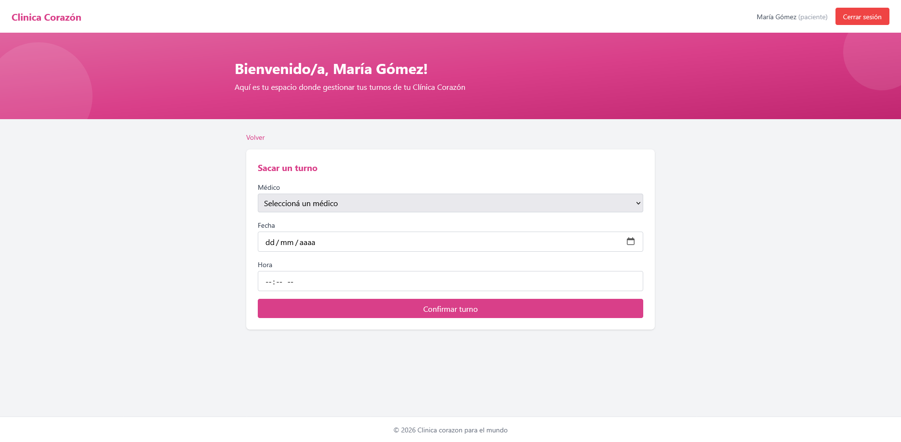

Inicio dashboard medico
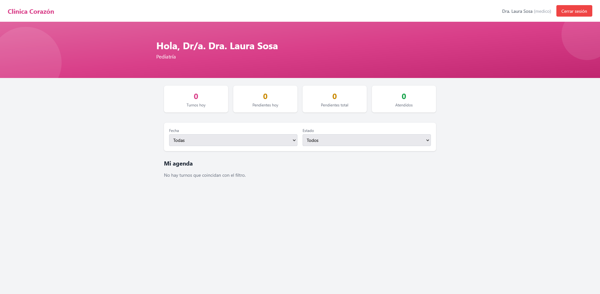

Inicio dashboard admin
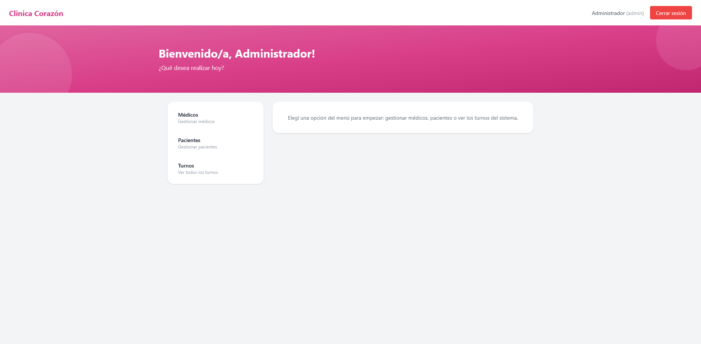

Gestion de medicos en admin
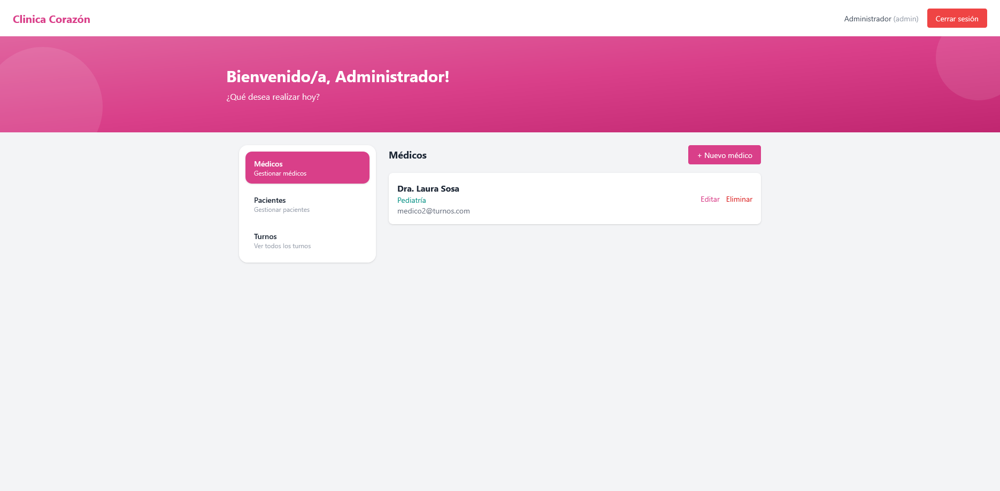

Gestion de pacientes en admin
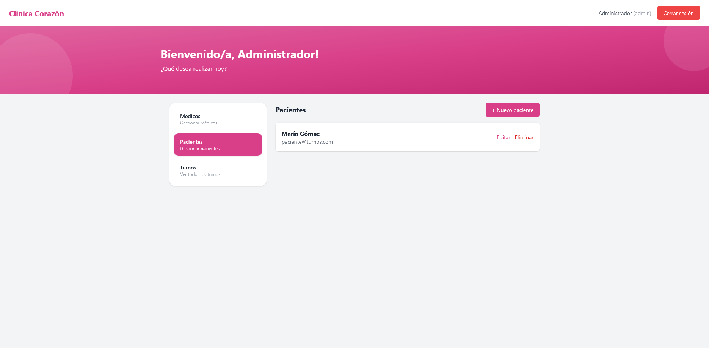

Vista de turnos en admin
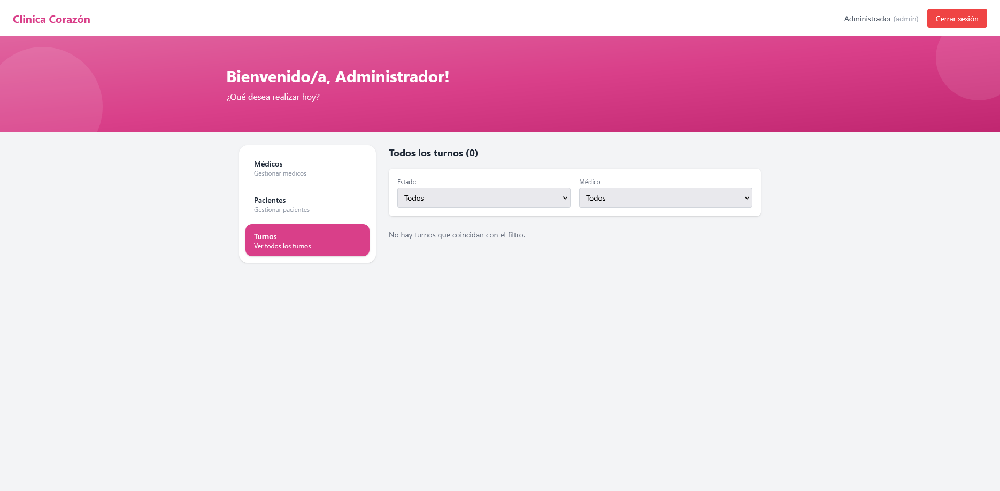

Contraseñas hasheadas
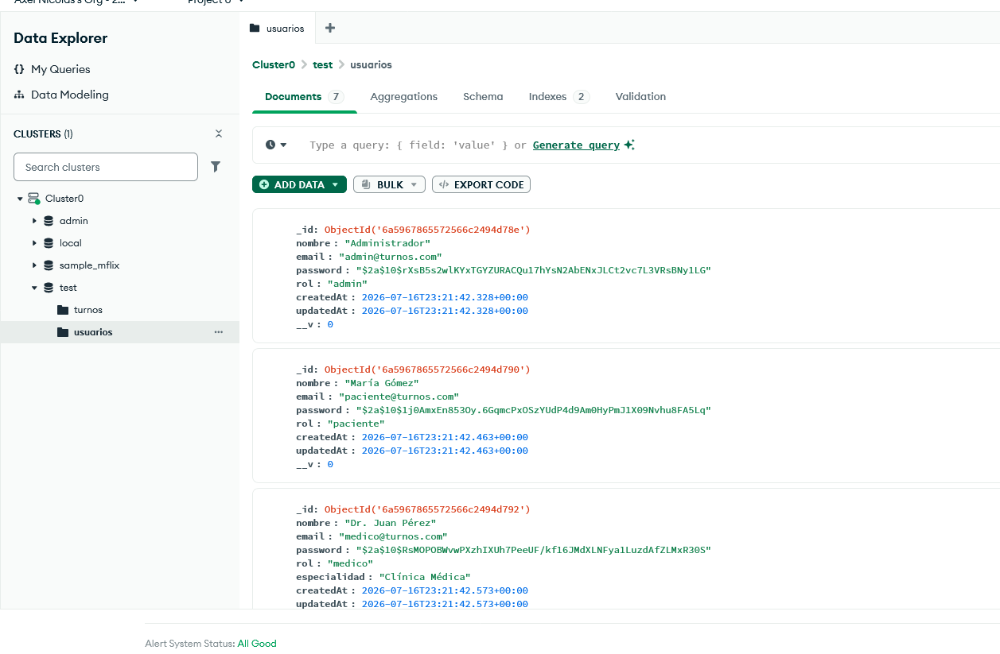

Live render
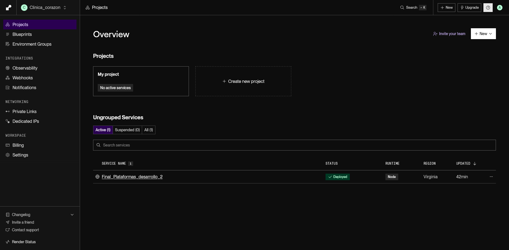

Live vercel
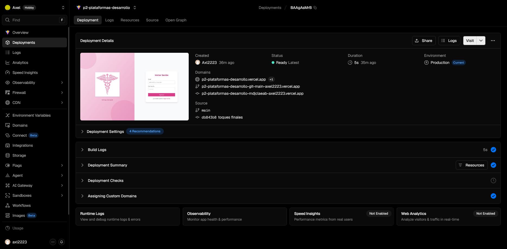

Mensaje_mongoDB
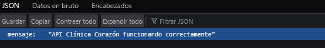

# Enlaces a la aplicación publicada

- **Frontend (Vercel):** < PEGAR AQUÍ TU URL DE VERCEL https://p2-plataformas-desarrollo.vercel.app/ >
- **Backend (Render):** https://final-plataformas-desarrollo-2.onrender.com
- **Repositorio (GitHub):** https://github.com/Axl2223/P2_Plataformas_desarrollo
